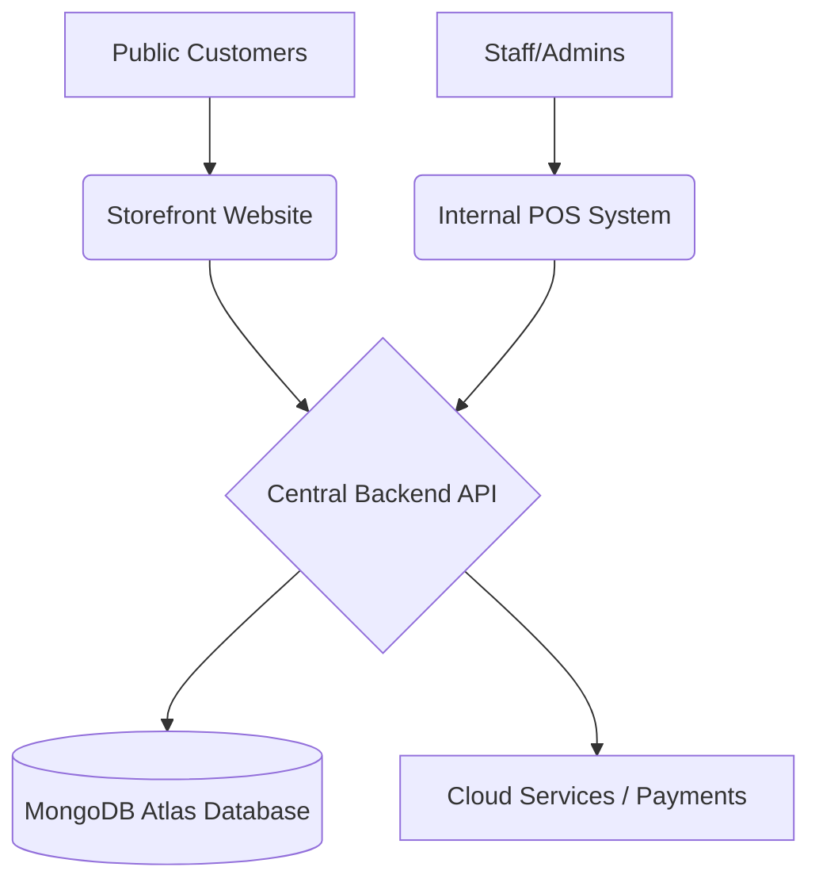

# 🏎️ Mudiyanse Auto Solutions — Unified Business Ecosystem


A professional-grade, multi-platform ecosystem designed for vehicle spare parts businesses. This system seamlessly integrates an **Internal POS (Point of Sale)** and a **Public E-commerce Storefront** into a single central management hub, ensuring 100% inventory accuracy and financial privacy.

> [!NOTE]
> Detailed technical documentation is available in the following files:
> - [Software Requirements Specification (SRS)](file:///Users/chamithdilshan/Desktop/Learning/My%20Projects/IN%202/SRS_Document.md)
> - [API Documentation](file:///Users/chamithdilshan/Desktop/Learning/My%20Projects/IN%202/API_Documentation.md)
> - [Deployment Guide](file:///Users/chamithdilshan/Desktop/Learning/My%20Projects/IN%202/Deployment_Guide.md)
> - [Database Design Specification](file:///Users/chamithdilshan/Desktop/Learning/My%20Projects/IN%202/Database_Design_Specification.md)

---

## 🏗️ System Architecture

The ecosystem consists of three main components working in harmony:



1.  **Shared Backend API (`/backend`):** High-performance Node.js/Express server handling authentication, inventory logic, and financial calculations.
2.  **Internal POS System (`/frontend`):** A high-speed interface for physical shop management, stock entries, and advanced business analytics.
3.  **Customer Storefront (`/storefront`):** A premium, glassmorphism-styled e-commerce website for retail customers to browse catalog and place orders.

---

## ✨ Key Features

### 🛒 Multi-Channel Sales
- **In-Store POS:** Walk-in billing with per-item discounts and multiple payment methods (Cash/Card/Online).
- **Public E-commerce:** Fully responsive catalog with cart management and shipping address capture.
- **Unified Inventory:** Stock is deducted in real-time regardless of whether the sale is physical or online.

### 👤 Role-Based Access Control (RBAC)
- **Admin:** Full access to Net Profits, Analytics, Staff Management, and Inventory.
- **Staff:** Access to POS Billing, Stock Viewing, and Order Processing. *Financial data (Buying Price/Profit) is strictly hidden.*
- **Customer:** Secure registration and order history tracking.

### 📈 Business Analytics (Admin Only)
- **Financial Tracking:** Revenue vs. Profit visualization across Daily/Weekly/Monthly periods.
- **Category Insights:** Sales distribution by vehicle type (Three-wheel, Bike, Car, etc.).
- **Inventory Health:** Real-time "Low Stock" pulse alerts and threshold notifications.

### 🎨 Modern UI/UX
- **Glassmorphism Design:** Sleek cards, frosted glass effects, and smooth transitions.
- **Theme Persistence:** Native Dark/Light mode support across all platforms.
- **Receipt Engine:** Thermal print-ready receipt generator for POS transactions.

---

## 🛠️ Tech Stack

- **Frontend:** React 19, Vite, Tailwind CSS v4, Lucide Icons
- **Backend:** Node.js, Express.js
- **Database:** MongoDB Atlas (Mongoose ODM)
- **Security:** JWT (JSON Web Tokens), Bcrypt.js, CORS scoping
- **Charts:** Recharts for data visualization

---

## 🚀 Getting Started

### 1. Prerequisites
- Node.js (v18+)
- MongoDB Atlas Account

### 2. Environment Setup
Create a `.env` file in the `/backend` directory:
```env
PORT=5001
MONGO_URI=your_mongodb_connection_string
JWT_SECRET=your_secret_key
```

### 3. Installation
Install dependencies for all modules:
```bash
# Backend
cd backend && npm install

# Internal POS
cd ../frontend && npm install

# Storefront
cd ../storefront && npm install
```

### 4. Database Seeding
Initialize the database with default products and an admin user:
```bash
cd backend && node seed.js
```

### 5. Running the Ecosystem
Open three terminals/tabs and run:

| Service | Command | URL |
| :--- | :--- | :--- |
| **Backend** | `cd backend && npm run dev` | `http://localhost:5001` |
| **POS Frontend** | `cd frontend && npm run dev` | `http://localhost:5173` |
| **Storefront** | `cd storefront && npm run dev` | `http://localhost:5174` |

---

## 🔑 Default Credentials

| Role | Email | Password |
| :--- | :--- | :--- |
| **Admin** | `admin@spareparts.lk` | `admin123` |

---

## 📁 Project Structure

```bash
IN 2/
├── backend/            # Centralized Node.js REST API
├── frontend/           # Internal Management POS (Admin/Staff)
├── storefront/         # Public E-commerce Platform (Customers)
├── CHANGELOG.md        # Detailed history of fixes and features
└── README.md           # This file
```

---

<div align="center">
  <p><b>Developed with ❤️ for Mudiyanse Auto Solutions</b></p>
  <p><i>Building the future of spare parts management.</i></p>
</div>
