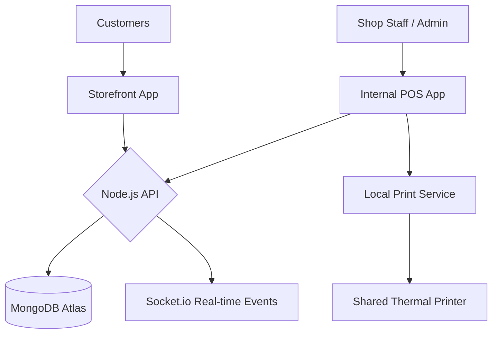

# 🏎️ Mudiyanse Auto Solutions — Unified Business Ecosystem


This repository contains a complete spare-parts business platform built for a retail shop with an internal POS, a public storefront, and a local thermal printing bridge. The system is designed to keep inventory synchronized, protect financial visibility by role, and support shop operations end-to-end from sales to analytics to printing.

## Contents

- Overview
- Architecture
- Workspace Layout
- Core Features
- Applications
- Data Model
- API Reference
- Setup
- Environment Variables
- Scripts
- Print Agent
- Operational Notes
- Troubleshooting

## Overview

The project is split into four working parts:

1. `backend` - centralized Node.js/Express API with MongoDB, JWT auth, sales logic, analytics, and inventory management.
2. `frontend` - internal POS application for admin and staff users.
3. `storefront` - customer-facing e-commerce storefront.
4. `print-agent` - local Windows service that sends receipts to a shared thermal printer.

The backend is the single source of truth for products, sales, customers, suppliers, returns, and user accounts. Both frontends consume the same API, so stock changes and sales are reflected everywhere immediately.

## Architecture


```mermaid
graph TD
    A[Shop Staff / Admin] --> B[Internal POS App]
    C[Customers] --> D[Storefront App]
    B --> E{Node.js API}
    D --> E
    E --> F[(MongoDB Atlas)]
    E --> G[Socket.io Real-time Events]
    B --> H[Local Print Service]
    H --> I[Shared Thermal Printer]
```

### How it fits together

- The backend serves REST endpoints under `/api`.
- The internal POS talks to the backend for billing, product search, analytics, and staff workflows.
- The storefront talks to the same backend for product browsing and customer order flows.
- The print-agent receives receipt jobs locally and prints via the Windows shared printer.

## Workspace Layout

```text
IN 2/
├── backend/               Node.js API, models, routes, controllers, seed data
├── frontend/              Internal POS for staff/admin users
├── storefront/            Public customer storefront
├── print-agent/           Local receipt printing bridge
├── README.md              This document
├── instruction.md         Project notes / product guidance
└── super_admin.md         Super admin reference notes
```

## Core Features

### Sales and Billing

- Fast POS checkout for shop sales.
- Cart quantity changes, item-level discounts, and bill-level discounts.
- Payment methods supported by the backend schema: Cash, Card, Online, COD, and KOKO.
- KOKO charge percentage can be edited at billing time and is saved with the sale.
- Sales receipts are generated after checkout and can be printed automatically.

### Inventory Management

- Create, edit, search, export, and import products.
- Track stock quantity, low-stock thresholds, and product activity.
- Products are categorized by vehicle and product type.
- Real-time inventory updates after sales and stock changes.

### Customer and Order Management

- Manage customers and customer credit information.
- Track supplier records.
- Track returns and order status changes.
- Support staff/admin separation for sensitive operational data.

### Analytics and Reporting

- Sales summary and historical sales browsing.
- Revenue and profit tracking.
- Category-level inventory and sales analysis.
- Low-stock alerts.

### Print Support

- Local receipt printing bridge for POS sales.
- Windows service installation for automatic startup.
- Shared thermal printer support.

## Applications

### Internal POS (`frontend`)

Used by admins and staff for:

- Product search and cart management.
- POS billing.
- Customer details at checkout.
- Discount entry and payment method selection.
- WhatsApp order fields such as delivery cost, paid amount, and tracking number.
- KOKO charge calculation and editable percentage during billing.
- Analytics and sales history pages for authorized users.

### Storefront (`storefront`)

Used by customers for:

- Browsing inventory items.
- Cart and checkout flow.
- Login and registration.
- Viewing customer orders.

### Backend (`backend`)

Provides:

- Authentication and user management.
- Product CRUD, import, export, and low-stock alerts.
- Sales creation, receipts, analytics, and order status updates.
- Customer, supplier, and return management.
- Socket.io support for real-time updates.

### Print Agent (`print-agent`)

Provides:

- `/health`, `/test`, `/print`, and `/open-drawer` endpoints.
- Direct ESC/POS printing to the shop printer.
- Optional Windows service installation for always-on printing.

## Data Model

### Users

Collection: `User`

- `name`
- `email`
- `password`
- `role` - `super_admin`, `admin`, `staff`, `customer`
- `status` - `pending`, `active`, `rejected`
- `shop`
- `isActive`
- `orderHistory`

### Products

Collection: `Product`

- `name`
- `sku_code`
- `category`
- `sub_category`
- `unit`
- `buying_price`
- `selling_price`
- `stock_quantity`
- `low_stock_threshold`
- `supplier`
- `description`
- `is_active`
- `shop`

### Sales

Collection: `Sale`

- `invoice_number`
- `items[]`
- `subtotal`
- `total_discount`
- `total_amount`
- `total_cost`
- `total_profit`
- `payment_method`
- `sale_source`
- `customer_name`
- `customer_phone`
- `customer`
- `order_status`
- `is_stock_restored`
- `tracking_number`
- `shipping_cost_charged`
- `actual_shipping_cost`
- `cod_amount`
- `paid_amount`
- `koko_charge`
- `koko_percentage`
- `shipping_address`
- `cashier`
- `cashier_name`
- `shop`
- `notes`

### Customers

Collection: `Customer`

- `name`
- `phone`
- `email`
- `address`
- `vehicle_plate`
- `vehicle_type`
- `credit_limit`
- `balance_due`
- `discount_pct`
- `notes`
- `isActive`

### Suppliers

Collection: `Supplier`

- supplier identity and contact details
- status and notes fields for operational tracking

### Returns

Collection: `Return`

- return reference data
- returned items
- reason and status tracking

## API Reference

All backend routes are mounted under `/api`.

### Auth

- `POST /api/auth/register`
- `POST /api/auth/login`
- `POST /api/auth/google`
- `GET /api/auth/me`

### Users

- `GET /api/users`
- `GET /api/users/customers`
- `PUT /api/users/:id/approve`
- `PUT /api/users/:id/reject`
- `PUT /api/users/:id/promote`
- `PUT /api/users/:id/toggle`
- `DELETE /api/users/:id`

### Products

- `GET /api/products`
- `GET /api/products/:id`
- `POST /api/products`
- `PUT /api/products/:id`
- `DELETE /api/products/:id`
- `GET /api/products/low-stock/alerts`
- `POST /api/products/import`
- `GET /api/products/export`

### Sales

- `POST /api/sales`
- `GET /api/sales`
- `GET /api/sales/:id`
- `GET /api/sales/:id/receipt`
- `GET /api/sales/analytics/summary`
- `GET /api/sales/my-orders`
- `PUT /api/sales/:id/status`
- `DELETE /api/sales/:id`

### Customers

- `GET /api/customers`
- `GET /api/customers/:id`
- `POST /api/customers`
- `PUT /api/customers/:id`
- `DELETE /api/customers/:id`
- `PUT /api/customers/:id/credit`

### Suppliers

- `GET /api/suppliers`
- `POST /api/suppliers`
- `PUT /api/suppliers/:id`
- `DELETE /api/suppliers/:id`

### Returns

- `GET /api/returns`
- `POST /api/returns`

### Health

- `GET /api/health`

## Setup

### Requirements

- Node.js 18 or newer
- MongoDB Atlas or another MongoDB instance
- A browser for the React apps
- Windows printer sharing if you use the print-agent

### Install Dependencies

```bash
cd backend
npm install

cd ../frontend
npm install

cd ../storefront
npm install

cd ../print-agent
npm install
```

### Seed Data

```bash
cd backend
node seed.js
```

The backend also includes `seedInventory.js`, `seedSuperAdmin.js`, and test helpers for auth and sales flows.

## Environment Variables

### Backend

Create `backend/.env`:

```env
PORT=5001
MONGO_URI=your_mongodb_connection_string
JWT_SECRET=your_secret_key
FRONTEND_URL=http://localhost:5173
```

### Internal POS Frontend

The internal POS uses `VITE_API_URL` when present.

```env
VITE_API_URL=http://localhost:5001
```

### Storefront

The storefront uses `/api` by default and supports an optional Google client ID.

```env
VITE_GOOGLE_CLIENT_ID=your_google_client_id
```

### Print Agent

```env
AGENT_PORT=9100
WINDOWS_PRINTER_PATH=\\YOUR-PC-NAME\\POS-80C
DRAWER_ENABLED=true
ALLOWED_ORIGINS=http://localhost:5173,http://localhost:5174
```

## Scripts

### Root

- `npm run backend` - start the backend in dev mode.
- `npm run frontend` - start the internal POS in dev mode.
- `npm run seed` - seed the database from the backend.
- `npm run install:all` - install backend and internal POS dependencies.

### Backend

- `npm run dev` - run with nodemon.
- `npm start` - run the server directly.

### Frontend and Storefront

- `npm run dev` - start Vite dev server.
- `npm run build` - production build.
- `npm run lint` - run ESLint.
- `npm run preview` - preview production build.

### Print Agent

- `npm start` - run the print bridge manually.
- `node install-service.js` - install as a Windows service.
- `node uninstall-service.js` - remove the service.

## Runtime Ports

| Service | Default Port | Notes |
| --- | --- | --- |
| Backend API | `5001` | Express + Socket.io |
| Internal POS | `5173` | Vite dev server |
| Storefront | `5174` | Vite dev server |
| Print Agent | `9100` | Local receipt service |

## Role Model

| Role | Purpose |
| --- | --- |
| `super_admin` | Full control, including destructive operations and user administration |
| `admin` | Operational control, analytics, inventory, and user management |
| `staff` | POS and stock-related work without full profit visibility |
| `customer` | Public storefront account and order history |

## Data Flow

1. Staff adds items to the POS cart.
2. POS calculates subtotal, item discount, bill discount, and payment-specific charges.
3. Checkout sends a sale payload to the backend.
4. Backend stores the sale, updates stock, and calculates profit.
5. POS receives the saved sale and prints a receipt.
6. Storefront orders go through the same backend and update the same inventory.

## Print Agent

The print-agent is intended for the shop computer only. It is separate from the web apps because browser-based printing is not reliable for thermal receipt printers in this setup.

### Endpoints

- `GET /health` - status and printer reachability.
- `GET /test` - prints a sample receipt.
- `POST /print` - prints a real sale receipt.
- `POST /open-drawer` - opens the cash drawer if enabled.

### Typical use

1. Run the print-agent locally on the shop PC.
2. Install it as a Windows service once testing passes.
3. Keep the printer share name stable so the service can reconnect after reboot.

## Operational Notes

- The backend allows localhost and Vercel/Railway origins through CORS.
- The POS uses token-based auth stored in local storage.
- The internal POS listens for Enter to complete checkout when the cart is not empty.
- KOKO charge is editable at billing time and is stored with both the charge amount and percentage.
- The sale schema auto-generates invoice numbers before save.
- Product search is indexed on name and SKU for faster lookup.

## Troubleshooting

| Symptom | Likely Cause | Fix |
| --- | --- | --- |
| API requests fail | Backend is not running or `VITE_API_URL` is wrong | Start backend on port 5001 and check the env value |
| Login redirects to `/login` | Token missing or expired | Sign in again and verify local storage token |
| Receipt does not print | Print-agent not running | Start the agent and confirm `/health` |
| Printer not reachable | Wrong Windows share name | Check the printer share path in `WINDOWS_PRINTER_PATH` |
| CORS error in browser | Frontend origin not allowed | Add the origin to backend CORS config or `FRONTEND_URL` |

## Screens and Modules

### Internal POS pages

- Dashboard / billing
- Inventory
- Customers
- Suppliers
- Sales history
- Analytics
- Alerts
- Users
- WhatsApp orders
- Web orders

### Storefront pages

- Storefront home
- Checkout
- Customer orders
- Login
- Register

### Shared frontend building blocks

- `api` layer for HTTP calls
- `context` for auth and theme state
- reusable `components` for receipts, layouts, inventory, analytics, and POS actions

## Notes for Maintainers

- Keep the backend as the canonical source of inventory and sale data.
- When changing a payment method or charge rule, update the sale schema, POS calculation, receipt rendering, and analytics summaries together.
- When adding a new frontend field, verify it is sent in the sale payload and saved in the backend model.
- If you introduce a new environment variable, document it here and in the relevant app README.

<div align="center">
  <p><b>Developed for Mudiyanse Auto Solutions</b></p>
  <p><i>POS, storefront, analytics, and receipt printing in one ecosystem.</i></p>
</div>
